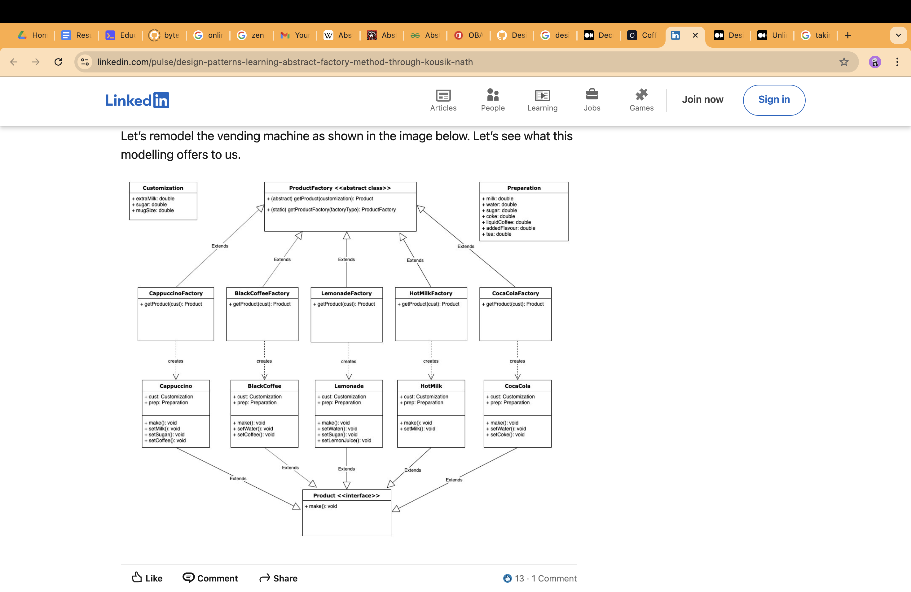

2 ways to create this coffe machine
-------------
1 ) abstract product is coffe from which all remaining concrete 
products are built
   -- smallcoffe, mediumcoffe

2) what if we have three diff abstract classes  smallcoffe , mediumcoffe and largecoffe
  and then create concrte product from these abstract products

which is better 

here product classification is  done by **size** but the product is same for all abstract classes which is coffe
so if we create three abs classes(small medium large), then these will contain
same properties [ there values might differ, but then this can be handled in concrete classes]

-- we should use singleton design pattern
-- we can use decorator to add addons

Problem--- some coffe may not contain milk and sugar  while some might be
 how to handle such situation of having multiple options

-- proportions of options might also be different for each type of coffe

--- one way we can do it using decorator patter
    -- but in this way,  we will not know the type of coffe so it will be hard to 
       select proportions as per coffee type

-- another way to let the concere class decide the proportion of milk, price, sugar
   following is the way

  -- but where to call different methods, as every concrete class will have 
  different method (getmilk(), addsugar() etc)

